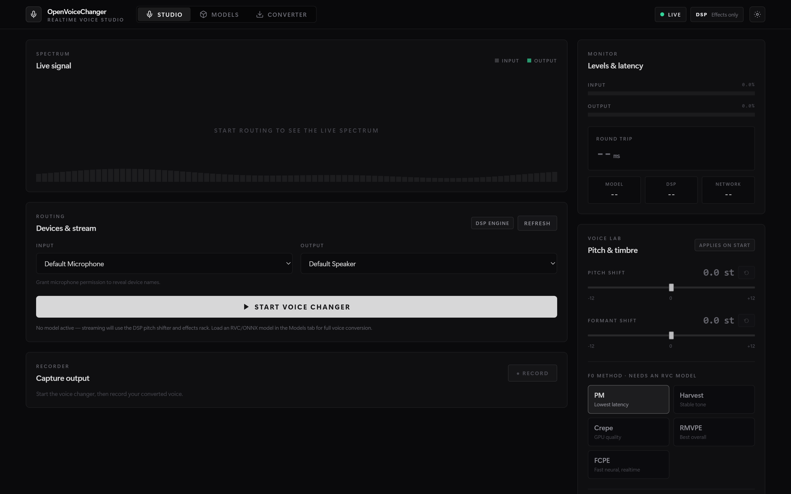
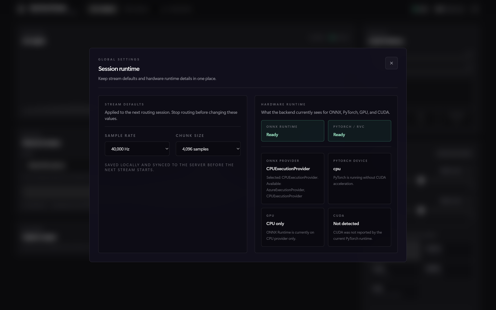

# OpenVoiceChanger

<p align="center">
  
  
  
  
  
</p>

<p align="center">
  Real-time AI voice changer web application.<br/>
  Route a microphone through ONNX or RVC models with a low-latency WebSocket audio pipeline.
</p>

<p align="center">
  <a href="#quick-start">Quick Start</a> •
  <a href="#model-support">Model Support</a> •
  <a href="#api">API</a> •
  <a href="#configuration">Configuration</a> •
  <a href="README_KR.md">한국어</a> •
  <a href="README_JP.md">日本語</a>
</p>

---

## Features

- Real-time voice conversion with binary WebSocket streaming and AudioWorklet
- ONNX and RVC model support
- Device routing from the browser
- Live pitch and F0 controls while streaming
- Session settings modal for sample rate, chunk size, and runtime visibility
- Runtime visibility for ONNX provider, PyTorch device, GPU, and CUDA status
- One active model at a time, with drag-and-drop upload and activation

## Screenshots

### Main UI



### Settings modal



## Quick Start

The commands below assume Windows PowerShell in the repository root.

### 0. Clone the repository

```powershell
git clone https://github.com/sioaeko/OpenVoiceChanger.git
cd OpenVoiceChanger
```

### 1. Backend setup

```powershell
python -m venv .venv
.venv\Scripts\Activate.ps1
python -m pip install --upgrade pip
pip install -r backend/requirements.txt
pip install --no-deps git+https://github.com/RVC-Project/Retrieval-based-Voice-Conversion
```

### 2. Optional: enable ONNX GPU acceleration

CPU ONNX works with the default requirements. If you want ONNX to use CUDA locally, replace the CPU package with the GPU package:

```powershell
pip uninstall -y onnxruntime
pip install onnxruntime-gpu==1.23.2
```

### 3. Frontend setup

```powershell
cd frontend
npm install
npm run build
cd ..
```

### 4. Prepare model assets

RVC `.pth` / `.pt` models need a HuBERT content encoder file.

```powershell
New-Item -ItemType Directory -Force models\assets | Out-Null
```

Place the file here:

```text
models/assets/hubert_base.pt
```

You can override that path with `OVC_HUBERT_PATH`.

### 5. Start the app

```powershell
.venv\Scripts\python.exe -m uvicorn backend.main:app --host 127.0.0.1 --port 8000
```

Open:

```text
http://127.0.0.1:8000
```

### 6. Optional: Vite dev mode

Terminal 1:

```powershell
.venv\Scripts\python.exe -m uvicorn backend.main:app --reload --host 127.0.0.1 --port 8000
```

Terminal 2:

```powershell
cd frontend
npm run dev
```

Then open `http://127.0.0.1:5173`.

## Model Support

| Format | Engine | Notes |
|--------|--------|-------|
| `.onnx` | ONNX Runtime | CPU by default, CUDA if `onnxruntime-gpu` is installed |
| `.pth` / `.pt` | PyTorch | RVC v1/v2 models, requires `hubert_base.pt` |

## Web UI Flow

1. Open the app in your browser.
2. Upload a model file in `Model Bay`.
3. Click `Activate` on the model you want to use.
4. Open `Settings` to review sample rate, chunk size, and runtime status.
5. Pick your input and output devices.
6. Click `Start Routing`.
7. Adjust pitch and F0 while the stream is running.

## API

| Method | Endpoint | Description |
|--------|----------|-------------|
| `GET` | `/health` | Health check |
| `GET` | `/api/config` | Sample rate, chunk size, ONNX runtime info, PyTorch runtime info |
| `GET` | `/api/models/` | List uploaded models |
| `POST` | `/api/models/upload` | Upload a model file |
| `DELETE` | `/api/models/{name}` | Delete a model |
| `POST` | `/api/models/{name}/activate` | Activate a model |
| `POST` | `/api/models/deactivate` | Deactivate the current model |
| `GET` | `/api/models/active` | Get the active model |
| `WS` | `/ws/audio` | Real-time audio streaming |

Interactive docs are available at `/docs` while the backend is running.

### WebSocket protocol

1. Connect to `/ws/audio`
2. Send JSON config: `{"sample_rate": 40000, "chunk_size": 4096}`
3. Send binary audio frames: `[uint32 seq_num][uint32 reserved][float32[] PCM samples]`
4. Receive processed audio frames in the same format
5. Send settings updates such as `{"pitch_shift": 3.0, "f0_method": "harvest"}`

## Configuration

Environment variables use the `OVC_` prefix.

| Variable | Default | Description |
|----------|---------|-------------|
| `OVC_MODELS_DIR` | `models` | Model directory |
| `OVC_HOST` | `0.0.0.0` | Backend bind address |
| `OVC_PORT` | `8000` | Backend port |
| `OVC_SAMPLE_RATE` | `40000` | Default sample rate |
| `OVC_CHUNK_SIZE` | `4096` | Default chunk size |
| `OVC_CORS_ORIGINS` | `["*"]` | Allowed CORS origins |
| `OVC_LOG_LEVEL` | `info` | Log level |
| `OVC_HUBERT_PATH` | `models/assets/hubert_base.pt` | HuBERT path for RVC |
| `OVC_RMVPE_ROOT` | `models/assets/rmvpe` | Optional RMVPE assets directory |
| `OVC_RVC_STREAM_CONTEXT_SECONDS` | `1.0` | Per-stream RVC context length |
| `OVC_RVC_INDEX_RATE` | `0.75` | Retrieval mix when a matching `.index` exists |
| `OVC_RVC_FILTER_RADIUS` | `3` | Harvest median filter radius |
| `OVC_RVC_RMS_MIX_RATE` | `0.25` | RMS envelope blend |
| `OVC_RVC_PROTECT` | `0.33` | Consonant protection |

## Project Structure

```text
OpenVoiceChanger/
├── backend/
│   ├── main.py
│   ├── config.py
│   ├── routers/
│   └── services/
├── frontend/
│   ├── public/
│   └── src/
├── models/
├── README.md
├── README_KR.md
├── README_JP.md
└── Makefile
```

## Makefile

The included `Makefile` is a convenience for POSIX shells or WSL.

| Command | Description |
|---------|-------------|
| `make install` | Install backend and frontend dependencies |
| `make dev` | Run backend and frontend dev servers |
| `make dev-backend` | Run backend only |
| `make dev-frontend` | Run frontend only |
| `make build` | Build the frontend |
| `make clean` | Remove build artifacts |

## Requirements

- Python 3.10+
- Node.js 18+
- npm

## License

[MIT](LICENSE)
