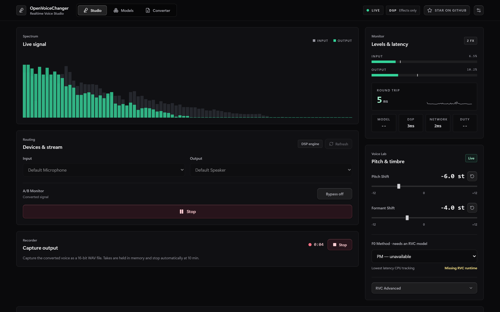
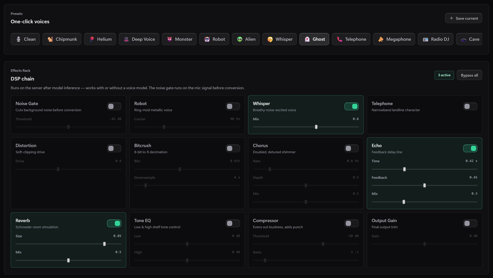
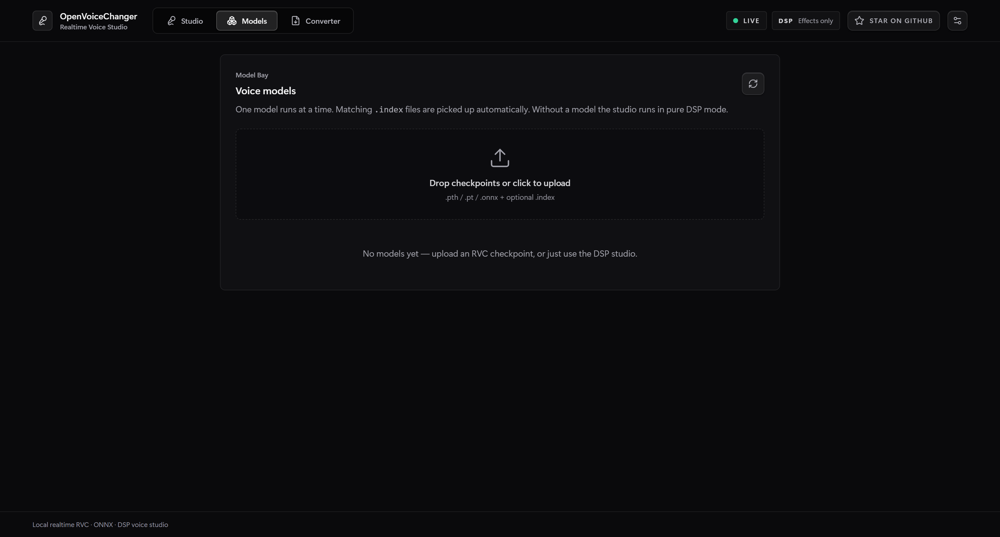
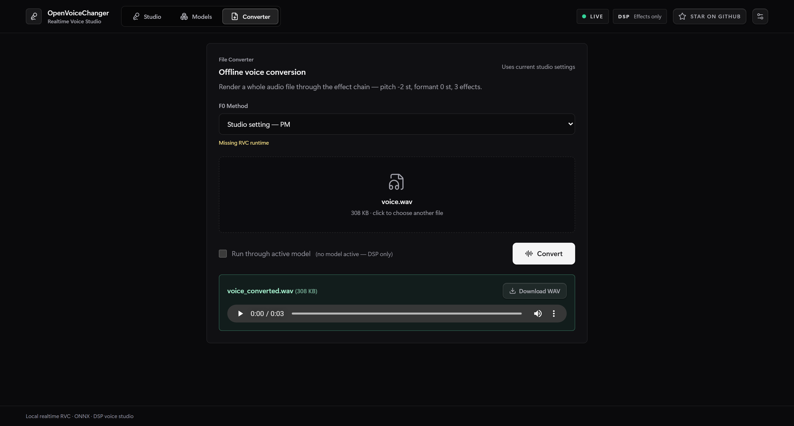
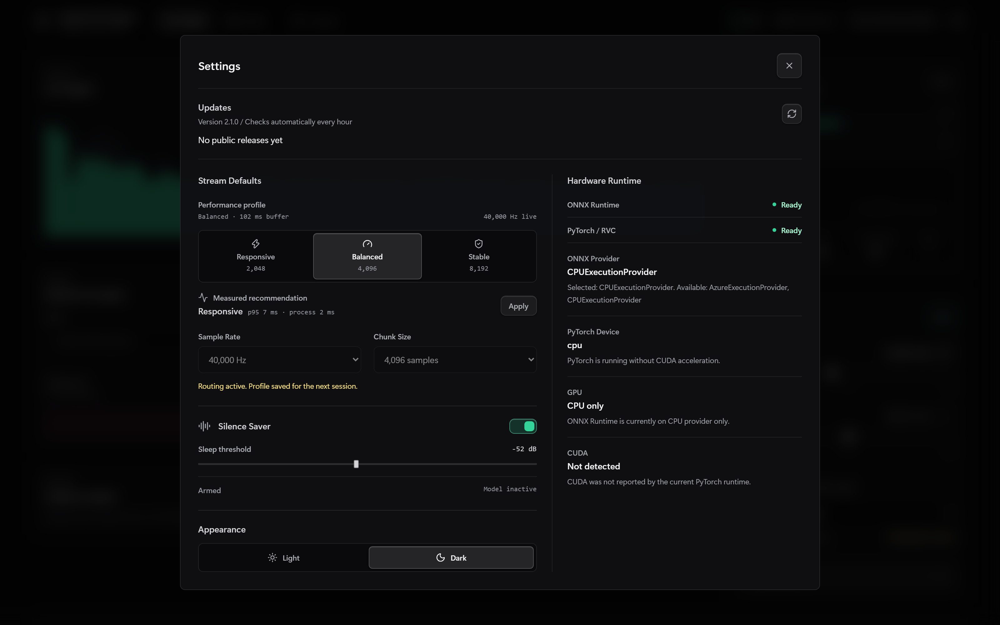

# OpenVoiceChanger

<p align="center">
  
  
  
  
  
</p>

<p align="center">
  リアルタイムAIボイスチェンジャー Webアプリケーション。<br/>
  ONNX または RVC モデルを低遅延の WebSocket オーディオパイプラインで接続します。
</p>

<p align="center">
  <a href="#クイックスタート">クイックスタート</a> •
  <a href="#モデルサポート">モデルサポート</a> •
  <a href="#api">API</a> •
  <a href="#設定">設定</a> •
  <a href="README.md">English</a> •
  <a href="README_KR.md">한국어</a>
</p>

---

## 機能

### リアルタイムスタジオ
- AudioWorklet とバイナリ WebSocket によるリアルタイム音声変換
- ONNX と RVC モデル対応 + **モデル不要の DSP モード**（チェックポイントなしでピッチシフトとエフェクトを使用可能）
- リアルタイムのピッチ **とフォルマント** シフト、**16 種の F0 方式**（PM / Harvest / DIO、Crepe と Mangio-Crepe、RMVPE、FCPE、それぞれの ONNX 版、オフライン専用のハイブリッド）— このマシンにランタイムやモデル資産がない方式は理由付きでグレー表示 — そして RVC 詳細パラメータ（index rate、filter radius、RMS mix、protect、Crepe hop length）
- **サーバーサイド 12 種エフェクトラック**: ノイズゲート、ロボット、ウィスパー、電話、ディストーション、ビットクラッシュ、コーラス、エコー、リバーブ、トーン EQ、コンプレッサー、出力ゲイン
- **内蔵ボイスプリセット 16 種**（チップマンク、ディープボイス、ロボット、ゴーストなど）+ Voice Lab の全状態を保存するユーザープリセット
- **Silence Saver** — 無音が続く間は重いモデル推論を休止しつつ DSP の残響を維持し、音声が戻った最初のチャンクで再開
- **計測ベースのパフォーマンスプロファイル**（Responsive / Balanced / Stable）— 直近の p95 往復レイテンシとサーバー処理時間からチャンクサイズを推奨
- リアルタイムスペクトラムビジュアライザー、ピークホールド付き VU メーター、レイテンシスパークライン、サーバー処理時間の内訳（モデル / DSP / ネットワーク）、推論 duty モニタリング
- **出力レコーダー** — 変換後の声を録音（<kbd>R</kbd>）してタイムスタンプ付き WAV でダウンロード、<kbd>B</kbd> で A/B バイパスを切り替え
- **テイクライブラリ**: 複数の WAV をブラウザの IndexedDB に保存し、名前変更・再生・ダウンロード・確認付き削除に対応。同じオリジンでの再読み込み後も復元しますが、ブラウザによるデータ削除や自動整理に備えて重要な録音はダウンロードしてください。保存失敗時も現在のタブでダウンロードと再保存が可能です。
- **ストリーム診断**: 入力チャンク時間、待機音声、再生バッファ、ブラウザが報告する出力遅延、破棄・タイムアウトしたフレーム、バッファ不足と再生の切り詰めを表示。往復時間は通信と処理の時間であり、マイクからスピーカーまでの実測遅延ではありません。カウンターはストリーム・接続ごとにリセットし、低頻度で更新します。
- アクティブモデルの推論失敗時は原音に切り替えず、出力をミュートしてエラーを表示します。選択した出力デバイスへの接続失敗時も既定のスピーカーを使わず、開始を中止します。
- サーバーが落ちても指数バックオフで自動再接続、待ちたくなければ **Retry now** で即再試行

### オフライン変換
- オーディオファイル（wav / mp3 / flac / ogg / m4a）をアップロードし、アクティブモデル + 現在の Voice Lab 設定 + エフェクトチェーンでレンダリングして WAV をダウンロード。長い変換は途中でキャンセル可能

### 管理
- ドラッグ & ドロップのモデルアップロード（`.pth` / `.pt` / `.onnx` + 付随する `.index`）、同時にアクティブなモデルは 1 つ
- モデルメタデータバッジ: RVC バージョン、ターゲットサンプルレート、F0 対応、index 有無、デバイス
- ライト / ダークテーマ、転送プロファイル、Silence Saver、ONNX / PyTorch / GPU / CUDA 状態をまとめた設定モーダル
- **RVC 準備状態**: Models と設定で必須パッケージ・HuBERT、任意の F0 資産、セットアップガイドと再チェックを確認できます。検出は推論成功の保証ではなく、モデル読み込み時に実行を検証します。再接続では音声・転送設定を維持し、機能情報とプリセットを更新します。
- アプリ内でアップデートを確認し、管理ランチャー経由でワンクリック **Update and restart**（[アップデート](#アップデート) 参照）
- リンクで共有できるタブ（`?tab=models`、`?tab=converter`、`?settings`）— タブを切り替えても選んだファイルや進行中の変換は保持され、ブラウザの戻る / 進むでタブ間を移動
- キーボードフォーカスが明確な Lucide アイコン操作と標準の tablist ナビゲーション + 通常のリポジトリリンクへ自然に切り替わる明示的な GitHub Star 操作

## スクリーンショット

すべてのキャプチャは、RVC ランタイムを入れていないマシンでモデルなしの DSP モードのスタジオを
実際に動かして撮ったものです。F0 セレクターが各方式を "unavailable" と表示しているのはそのためで、
推論スタックをインストールする前のユーザーが目にする画面そのものです。

### スタジオ



**Deep Voice** プリセットを適用してストリーミング中のリアルタイムワークスペース: 入力 / 出力の
ライブスペクトラム、ピークホールド付き VU メーター、5 ms の往復レイテンシとスパークラインおよび
DSP / ネットワークの内訳、録音中のテイク、そしてピッチ・フォルマント・F0 方式のコントロール。

### プリセット & エフェクトラック



ワンクリックのボイスプリセット 16 種とサーバーサイド 12 種の DSP チェーン。ここでは **Ghost** を選び、
ウィスパー・エコー・リバーブが有効です。ユーザープリセットは F0、retrieval、filter、RMS、protect、
Crepe hop の設定も保存します。モデルなしでもすべて動作し、エフェクトはライブストリームに即時反映されます。

### モデル



RVC / ONNX チェックポイントと付随する `.index` ファイルのドラッグ & ドロップアップロード、
メタデータバッジ、ワンクリックのアクティベート。

### コンバーター



オーディオファイル全体をアクティブモデル + エフェクトチェーンでレンダリングし、試聴してから WAV として
ダウンロードします。RVC 変換はリアルタイムストリームの短いコンテキスト窓を使わずファイル全体を処理し、
現在の Index Rate、Filter Radius、RMS Mix、Protect も反映します。

### 設定



アップデート状態、ライブストリームから**計測した推奨**付きの転送プロファイル、Silence Saver 設定、
ライト / ダークテーマに加え、バックエンドが認識している ONNX provider、PyTorch device、GPU、CUDA の
状態を表示します。

これらの画像は手動キャプチャではなく生成物です。`node scripts/readme_screenshots.mjs` が起動中の
バックエンドに対してヘッドレス Chromium を立ち上げ、合成音声をマイク入力として撮影します。

## クイックスタート

以下のコマンドは Windows PowerShell を前提に、リポジトリのルートで実行します。

### 0. リポジトリを clone

```powershell
git clone https://github.com/sioaeko/OpenVoiceChanger.git
cd OpenVoiceChanger
```

### 1. バックエンドセットアップ

```powershell
python -m venv .venv
.venv\Scripts\Activate.ps1
python -m pip install --upgrade pip
pip install -r backend/requirements.txt
pip install --no-deps git+https://github.com/RVC-Project/Retrieval-based-Voice-Conversion
```

### 2. 任意: ONNX GPU アクセラレーションを有効化

デフォルトの `requirements.txt` は CPU 版 ONNX Runtime を導入します。ローカルで CUDA を使いたい場合は、CPU 版を削除して GPU 版に置き換えてください。

```powershell
pip uninstall -y onnxruntime
pip install onnxruntime-gpu==1.23.2
```

### 3. フロントエンドセットアップ

```powershell
cd frontend
npm install
npm run build
cd ..
```

### 4. モデル資産の準備

**Windows x64 CPU 自動セットアップ:** `python launch.py` で起動して
**Models > RVC readiness > Set up RVC > Install and restart** を選択します。
`data/rvc-setup/` に独立した Python 3.10.20 環境、ハッシュ固定の CPU パッケージ、
コミット固定の RVC/fairseq 推論ソースを導入し、HuBERT・RMVPE を SHA-256 検証して
ダウンロードします。モデル資産は 353.5 MiB、Python・パッケージは別途必要です。
空き容量は最低 6 GiB。既存の Python/CUDA、音声モデル、プリセット、録音テイクは
置き換えません。音声処理と変換を停止し、未保存の録音を保存してから実行してください。
HuBERT/RMVPE の実推論と API import 検査後にだけ切り替え、再起動失敗時は以前の環境へ
復旧します。切り替え前のキャンセル、検証済みダウンロードを再利用する再試行に対応。
ログは `data/rvc-setup/jobs/<job-id>/setup.log`。失敗した環境は診断用に残ります。
GPU アクセラレーション、音声チェックポイント、学習用拡張、任意の ONNX F0 重みは
含みません。他の OS は手動セットアップを利用してください。管理ランチャーは次回も
選択環境を使いますが、直接起動した `uvicorn` には適用されません。

配布元とハッシュは [`setup_manifest.py`](backend/services/setup_manifest.py)、
依存関係とロックファイルは [`backend/runtime/`](backend/runtime/) にあります。
固定 HuBERT ハッシュ一致時のみレガシー設定オブジェクトを読み込みます。
アップロードされた音声チェックポイントの安全な読み込み制限は維持します。

手動セットアップの場合:

RVC `.pth` / `.pt` モデルには HuBERT コンテンツエンコーダが必要です。

```powershell
New-Item -ItemType Directory -Force models\assets | Out-Null
```

配置先:

```text
models/assets/hubert_base.pt
```

別の場所を使う場合は `OVC_HUBERT_PATH` を設定してください。

### 5. アプリ起動

```powershell
.venv\Scripts\python.exe launch.py
```

ブラウザで開く URL:

```text
http://127.0.0.1:8000
```

### 6. 任意: Vite 開発モード

ターミナル 1:

```powershell
.venv\Scripts\python.exe -m uvicorn backend.main:app --reload --host 127.0.0.1 --port 8000
```

ターミナル 2:

```powershell
cd frontend
npm run dev
```

その後 `http://127.0.0.1:5173` を開いてください。

## アップデート

起動時と毎時間、公式 GitHub の公開リリースを確認します。現在より新しい安定版 (`vMAJOR.MINOR.PATCH`) があるときだけ、ヘッダーに **Update available** ボタンが表示されます。下書き、プレリリース、通常のコミットは対象外です。設定からの手動確認は1分に1回までです。同意なしにインストールすることはありません。

**Update and restart** には `python launch.py` での起動、Git、公式の `origin`、変更のない `main` ブランチが必要です。ランチャーはビルド済みフロントエンドを取得し、GitHub の SHA-256 とファイル別マニフェストを検証してから、検証済みリリースコミットへ fast-forward して再起動します。GitHub ログイン、ローカル Node.js ビルド、pip インストール、CUDA の変更は行いません。Python 依存関係が変わるリリースは手動更新が必要です。ZIP ソースや `uvicorn` 直接起動では通知のみ利用できます。

- 音声ルーティングを停止してから更新します。アップロード、ファイル変換、直前の音声処理中はサーバー側でも更新を拒否します。
- テイクの保存完了を待つか、保存に失敗したテイクと未保存の変換結果をダウンロードしてから再起動します。保存済みテイクは更新を妨げません。他のタブは自動で再読み込みしません。
- モデル、`data/presets.json`、ブラウザに保存した設定は保持します。新しいサーバーが起動しない場合は以前のコードと画面を復元します。途中でローカルコードが変更された場合、上書きせず復旧を停止します。
- 復旧用ファイルは `tmp/updater/jobs/` に残ります。復旧に失敗した場合は、チェックアウトを変更する前に `tmp/updater/state.json` とランチャーログを確認してください。
- `OVC_UPDATE_CHECK_ENABLED=false` でバックグラウンド確認を無効にできます。手動確認は引き続き可能です。CORS を開放してもインストールは同じ端末からのみ許可されます。

配布時は `VERSION` とフロントエンドの2つのパッケージバージョンを更新して `main` にコミットし、対応する `vX.Y.Z` タグを push します。Release ワークフローがテストとビルドを実行し、`OpenVoiceChanger-frontend-vX.Y.Z.zip` とチェックサムを下書きにアップロードした後で公開します。`python scripts/package_release.py` はクリーンなビルド済みチェックアウトをパッケージ化するだけで、公開はしません。最初のリリースで配布経路が整い、インストール済みのアプリは自身より新しいバージョンだけを通知します。

## モデルサポート

| 形式 | エンジン | 備考 |
|------|----------|------|
| `.onnx` | ONNX Runtime | デフォルトは CPU、`onnxruntime-gpu` 導入時は CUDA |
| `.pth` / `.pt` | PyTorch | RVC v1/v2、`hubert_base.pt` が必要 |

## Web UI の流れ

1. ブラウザでアプリを開く
2. （任意）`Models` タブでモデルをアップロードしてアクティベートする — モデルがなければ純粋な DSP モードで動作します
3. 必要に応じて Settings でパフォーマンスプロファイルと Silence Saver のしきい値を調整する
4. `Studio` タブで入力 / 出力デバイスを選ぶ
5. `Start Voice Changer` を押す
6. ピッチ、フォルマント、F0 方式、エフェクトラック、ワンクリックプリセットで声をリアルタイムに変える
7. <kbd>B</kbd> キー（または `A/B Monitor`）でストリームを止めずに変換音と原音を比較する
8. 出力を録音するか（<kbd>R</kbd> で録音の開始 / 停止）、`Converter` タブでファイル全体を変換する

1 文字のショートカットは入力欄でタイプしている間は動作せず、タブを切り替えても別のタブでの作業はリセットされません。

## API

| メソッド | エンドポイント | 説明 |
|----------|----------------|------|
| `GET` | `/health` | ヘルスチェック |
| `GET` | `/api/config` | アプリのバージョン、ストリームと Silence Saver のデフォルト、ONNX / PyTorch ランタイム情報、F0 方式ごとの利用可否 |
| `GET` | `/api/updates` | キャッシュ済みリリース状態、現在のバージョン、更新の進行状況 |
| `POST` | `/api/updates/check` | 明示的なローカル更新確認 (頻度制限あり) |
| `POST` | `/api/updates/install` | 検証済みバージョンの更新と再起動を予約 (管理ランチャーのみ) |
| `GET` | `/api/github/star` | 現在の GitHub CLI アカウントの Star 状態を確認 |
| `POST` | `/api/github/star` | 同じ端末のブラウザで明示的に押した場合、このリポジトリに Star を追加 |
| `GET` | `/api/models/` | アップロード済みモデル一覧 |
| `POST` | `/api/models/upload` | モデルアップロード |
| `DELETE` | `/api/models/{name}` | モデル削除 |
| `POST` | `/api/models/{name}/activate` | モデルをアクティベート |
| `POST` | `/api/models/deactivate` | 現在のモデルを無効化 |
| `GET` | `/api/models/active` | アクティブモデル取得 |
| `GET` | `/api/presets/` | 内蔵 + ユーザープリセット一覧 |
| `POST` | `/api/presets/` | ユーザープリセット保存 |
| `DELETE` | `/api/presets/{id}` | ユーザープリセット削除 |
| `POST` | `/api/convert/` | オフラインファイル変換（multipart アップロード → WAV） |
| `WS` | `/ws/audio` | リアルタイムオーディオストリーミング |

バックエンド起動中は `/docs` で Swagger UI を利用できます。

### WebSocket プロトコル

1. `/ws/audio` に接続
2. JSON 設定を送信: `{"sample_rate": 40000, "chunk_size": 4096}`
3. バイナリオーディオフレームを送信: `[uint32 seq_num][uint32 reserved][float32[] PCM samples]`
4. 同じ形式で処理済みオーディオフレームを受信 — レスポンスの `reserved` フィールドにサーバー処理時間（1/100 ms 単位）が入ります
5. 必要に応じて設定を送信:
   `{"pitch_shift": 3.0, "formant_shift": -2.0, "f0_method": "rmvpe", "index_rate": 0.75, "filter_radius": 3, "rms_mix_rate": 0.25, "protect": 0.33, "crepe_hop_length": 160, "silence_saver": true, "silence_threshold_db": -52, "effects": {"reverb": {"enabled": true, "size": 0.6, "mix": 0.4}}}`
6. 定期的なステータス JSON を受信: `{"type": "status", "latency_ms": …, "model_ms": …, "dsp_ms": …, "mode": "rvc|onnx|dsp|bypass", "bypass": false, "inference_sleeping": false, "inference_duty_percent": 100.0, "effects_active": …}`

設定フィールドはすべて任意で、未知のフィールドは無視されるため、本リリースの
前後どちらのクライアント／サーバーとも相互運用できます。

サーバーはチャンクを 1 つずつ処理するため、応答より速く送るとキューが積み上がり、
それがそのまま自分のレイテンシになります。同梱のフロントエンドは**送信中フレームを 1 つ**
だけ持ち、最大 2 つを待機させ、溢れたら最も古い待機フレームを捨て（ライブモニターでは
新しい音声の方が古い音声より価値があります）、2 秒応答のないフレームは見切ることで、
応答が 1 つ失われても送信が止まらないようにしています。外部クライアントも同じ
バックプレッシャーを適用してください。

初期 config で送るサンプルレートは、要求値ではなく `AudioContext` が**実際に**
動作しているレート (`audioContext.sampleRate`) を送ってください。ブラウザは
要求を無視することがあり、サーバーはここで報告された値で処理・リサンプルします。

#### 変換バイパス (A/B)

`{"bypass": true}` は入力信号をそのまま返します。ノイズゲート、モデル、ピッチ・
フォルマントシフト、エフェクトラックのすべてを通しません。マイク・WebSocket・
出力ルーティングは動作したままなので、停止ではなく変換後の音との真の A/B 比較に
なります。UI では <kbd>B</kbd> キーで切り替えられます。

これはエフェクトラックの **Bypass all** ボタンとは別物です。後者はエフェクトを
解除するだけで、モデル変換は動作し続けます。

#### パフォーマンスプロファイルと Silence Saver

Settings の **Responsive**、**Balanced**、**Stable** は、それぞれ 2048、4096、
8192 サンプルのチャンクを使います。ライブ測定が 8 件以上集まると、直近の p95
往復レイテンシとモデル + DSP 処理時間から、処理余裕を確保できる最小のプロファイルを
推奨します。ルーティング中に選んだプロファイルは次のセッションに適用され、手動の
サンプルレートとチャンクサイズはルーティング停止までロックされます。

Silence Saver はデフォルトで `-52 dB` にて有効で、`-80` から `-20 dB` まで調整
できます。モデルが有効な状態で入力が 180 ms しきい値を下回ると、そのストリームの
モデルコンテキストを解放して推論をスキップします。エコーとリバーブの残響が自然に
減衰するよう無音で post-effect 段は継続し、音声が戻った最初のチャンクで再開します。
モニターの `Saver` は現在の休止状態、`Duty` はモデル推論対象フレームのうち実際に
推論した割合です。DSP のみのモードは休止しません。

#### GitHub Star ボタン

ヘッダーのボタンは、この固定リポジトリに対する一つの明示的な操作だけを行います。
ループバックブラウザからユーザーが直接押すと、現在認証済みの GitHub CLI（`gh`）
アカウントで `sioaeko/OpenVoiceChanger` に Star を追加し、認証情報はフロントエンドに
渡りません。`gh` がない、未認証、接続できない、または別端末から開いている場合は、
GitHub 上でユーザー自身が判断できる通常のリポジトリリンクに切り替わります。

## 設定

環境変数は `OVC_` プレフィックスを使います。

| 変数 | デフォルト | 説明 |
|------|------------|------|
| `OVC_MODELS_DIR` | `models` | モデルディレクトリ |
| `OVC_HOST` | `127.0.0.1` | バックエンド bind アドレス — 既定はループバックのみ |
| `OVC_PORT` | `8000` | バックエンドポート |
| `OVC_SAMPLE_RATE` | `40000` | クライアントに提案するサンプルレート（実際のレートはブラウザが報告） |
| `OVC_CHUNK_SIZE` | `4096` | 既定のチャンクサイズ |
| `OVC_CORS_ORIGINS` | `["http://localhost:5173", "http://127.0.0.1:5173", "http://localhost:8000", "http://127.0.0.1:8000"]` | HTTP と音声 WebSocket の両方に適用される origin 許可リスト |
| `OVC_ALLOW_ANY_ORIGIN` | `false` | origin 検証を完全に無効化（信頼できるネットワークのみ） |
| `OVC_LOG_LEVEL` | `info` | ログレベル |
| `OVC_HUBERT_PATH` | `models/assets/hubert_base.pt` | RVC 用 HuBERT パス |
| `OVC_RMVPE_ROOT` | `models/assets/rmvpe` | RMVPE 資産ディレクトリ（`rmvpe.pt`）— `rmvpe` F0 方式を有効化 |
| `OVC_RMVPE_ONNX_PATH` | `models/assets/rmvpe/rmvpe.onnx` | ONNX RMVPE モデル — `rmvpe-onnx` を有効化 |
| `OVC_CREPE_ONNX_FULL_PATH` | `models/assets/crepe/full.onnx` | ONNX Crepe（full）モデル — `crepe-onnx-full` を有効化 |
| `OVC_CREPE_ONNX_TINY_PATH` | `models/assets/crepe/tiny.onnx` | ONNX Crepe（tiny）モデル — `crepe-onnx-tiny` を有効化 |
| `OVC_CREPE_HOP_LENGTH` | `160` | Mangio-Crepe 方式の既定 hop length（64–512） |
| `OVC_RVC_STREAM_CONTEXT_SECONDS` | `0.14` | 各ストリームが推論をやり直す 16 kHz 履歴の長さ |
| `OVC_RVC_INDEX_RATE` | `0.75` | `.index` がある場合の retrieval mix |
| `OVC_RVC_FILTER_RADIUS` | `3` | Harvest / DIO median filter 半径（3 未満で無効） |
| `OVC_RVC_RMS_MIX_RATE` | `0.25` | RMS envelope blend |
| `OVC_RVC_PROTECT` | `0.33` | 子音保護値 |
| `OVC_RVC_ALLOW_UNSAFE_CHECKPOINTS` | `false` | 安全な読み込みに失敗したチェックポイントの unpickle を許可（[セキュリティ](#セキュリティ)参照） |
| `OVC_PRESETS_PATH` | `data/presets.json` | ユーザープリセット保存ファイル |
| `OVC_MAX_CONVERT_SECONDS` | `600` | オフライン変換の最大オーディオ長 |
| `OVC_UPDATE_CHECK_ENABLED` | `true` | 起動時と毎時間の公開リリース確認。クリックせずにインストールしない |

`OVC_RVC_STREAM_CONTEXT_SECONDS` はバッファサイズではなくレイテンシと品質の
トレードオフです。各チャンクはこのウィンドウ全体に対して推論されるため、値を
大きくすると連続性は向上しますが、チャンクごとの推論コストが倍増します。
既定の 4096 サンプルチャンクでは `0.14` がリアルタイムの余裕を保ちます。

## セキュリティ

このスタジオはモデルチェックポイントをアップロードして実行し、マイクを開くため、
既定値はシングルユーザーのマシンを前提としています。

### ネットワークアクセス

- **bind アドレス**: `OVC_HOST` の既定は `127.0.0.1` です。変更しない限り、
  マシン外から API に到達できません。
- **origin**: クロスオリジンの HTTP リクエストと WebSocket ハンドシェイクは
  `OVC_CORS_ORIGINS` で検証されます。`Origin` ヘッダーを持たないリクエスト
  （curl、ネイティブクライアント、テスト）は許可され、不透明な `null` origin は
  拒否されます。
- **same-origin は常に許可**: このバックエンドが配信したページはどのアドレスでも
  検証を通過するため、フロントエンドを LAN ホストに移しても許可リストの変更は
  不要です。悪意ある第三者のページはブラウザが自身の origin を送るため通過できません。

ブラウザは WebSocket に same-origin ポリシーを適用しないため、この検証がないと
訪問した任意のサイトがこのバックエンド経由でマイクストリームを開けてしまいます。

LAN 上の別デバイスから使う場合:

```bash
OVC_HOST=0.0.0.0 python -m uvicorn backend.main:app --host 0.0.0.0 --port 8000
```

同じバックエンドからビルド済みフロントエンドを配信する場合、追加設定は不要です。
Vite 開発サーバーを別ホストで動かす場合のみ、その origin を追加してください:

```bash
export OVC_CORS_ORIGINS='["http://192.168.1.50:5173"]'
```

なおブラウザはセキュアな origin でのみマイク取得を許可します。平文 HTTP では
`localhost` 以外で `getUserMedia` が利用できません。LAN 配置には HTTPS を使うか、
ホストマシン上で使用してください。

### モデルチェックポイント

RVC の `.pth` は Python の pickle であり、PyTorch の従来の `weights_only=False`
で読み込むとファイル作成者の任意コードが実行されます。チェックポイントは Web の
アップロードエンドポイント経由で届くため、バックエンドは PyTorch の安全な
weights-only モードで読み込みます（numpy 値を保存したチェックポイントも読める
よう、データ専用の numpy シンボルを追加しています）。

その方法で読み込めないチェックポイントは、黙って unpickle せずに説明付きの
エラーで有効化が失敗します。信頼できるファイルに限り、デプロイごとに明示的に
オプトインしてください:

```bash
OVC_RVC_ALLOW_UNSAFE_CHECKPOINTS=true python -m uvicorn backend.main:app
```

このパスを通るたびに、バックエンドはファイル名を含む警告をログに出力します。

## テスト

```bash
pip install -r backend/requirements-test.txt
python -m pytest          # バックエンド

cd frontend && npm install
npm run lint              # ESLint（react-hooks ルールはエラー扱い）
npm test                  # フロントエンド（vitest: lib モジュール + SSR コンポーネント検査）
npm run build
```

`backend/requirements-test.txt` は意図的に `backend/requirements.txt` より軽量です。テストは
転送層、DSP チェーン、オフライン変換、origin 検証、チェックポイント読み込み、アップデーターを
対象とし、いずれも RVC 推論スタック全体を必要としません。CI（`.github/workflows/ci.yml`）は
Linux でバックエンド、Windows でアップデーター・セットアップ、フロントエンドの lint・テスト・
ビルドを実行します。別の Windows ジョブは `python -m scripts.verify_runtime_setup` を実行し、
空のキャッシュからダウンロードして HuBERT/RMVPE 推論、管理サーバーの二回の起動と完全終了を
検証します。このネットワーク検証には最低 6 GiB の空き容量が必要です。診断用の独立環境は
`tmp/runtime-cold-*` に残ります。

フロントエンドのテストは Node・jsdom・SSR を使うため、実際のブラウザの挙動は別途確認します。
`node scripts/readme_screenshots.mjs` はヘッドレス Chromium で実際のストリームを開始する
スモークテストとしても機能します。

## プロジェクト構成

```text
OpenVoiceChanger/
├── backend/
│   ├── main.py
│   ├── config.py
│   ├── security.py
│   ├── version.py
│   ├── routers/
│   └── services/
├── frontend/
│   ├── public/
│   └── src/
├── tests/
├── scripts/            # リリースパッケージング、README スクリーンショット生成
├── docs/images/
├── models/
├── .github/workflows/  # ci.yml, release.yml
├── launch.py           # 管理ランチャー（アプリ内アップデートを有効化）
├── VERSION
├── README.md
├── README_KR.md
├── README_JP.md
└── Makefile
```

## Makefile

`Makefile` は POSIX シェルまたは WSL 向けの補助コマンドです。

| コマンド | 説明 |
|----------|------|
| `make install` | バックエンドとフロントエンドの依存関係をインストール |
| `make install-test` | バックエンドのテスト依存関係をインストール |
| `make dev` | バックエンドとフロントエンドの開発サーバーを起動 |
| `make dev-backend` | バックエンドのみ起動 |
| `make dev-frontend` | フロントエンドのみ起動 |
| `make lint` | フロントエンドを lint |
| `make test` | バックエンドとフロントエンドのテストを実行 |
| `make test-backend` | バックエンドのテストのみ実行 |
| `make test-frontend` | フロントエンドのテストのみ実行 |
| `make build` | フロントエンドをビルド |
| `make clean` | ビルド成果物を削除 |

## 要件

- Python 3.10+
- Node.js 20.19+（Vitest 4 と ESLint 10 は Node 18 では動作しません）
- npm

## ライセンス

[MIT](LICENSE)
