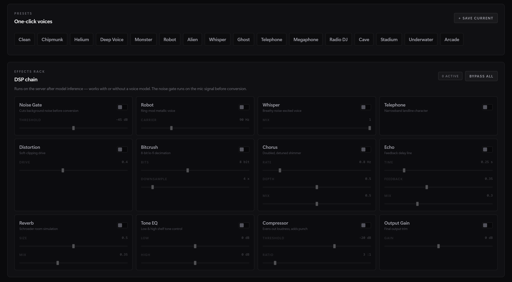
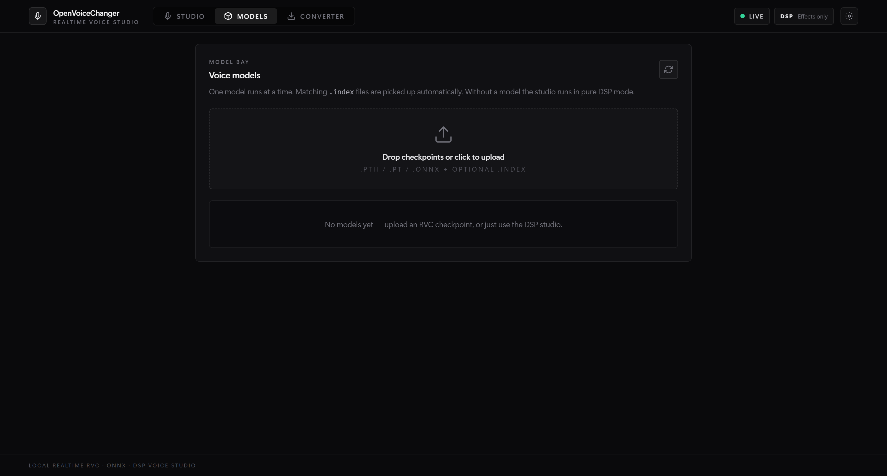
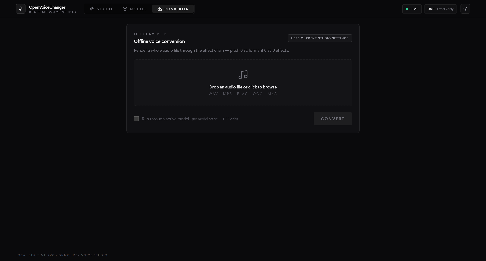

# OpenVoiceChanger

<p align="center">
  
  
  
  
  
</p>

<p align="center">
  실시간 AI 보이스 체인저 웹 애플리케이션.<br/>
  ONNX 또는 RVC 모델을 낮은 지연의 WebSocket 오디오 파이프라인으로 연결합니다.
</p>

<p align="center">
  <a href="#빠른-시작">빠른 시작</a> •
  <a href="#모델-지원">모델 지원</a> •
  <a href="#api">API</a> •
  <a href="#설정">설정</a> •
  <a href="README.md">English</a> •
  <a href="README_JP.md">日本語</a>
</p>

---

## 기능

### 실시간 스튜디오
- AudioWorklet + 바이너리 WebSocket 기반 실시간 음성 변환
- ONNX와 RVC 모델 지원 + **모델 없이 동작하는 DSP 모드** (체크포인트 없이 피치 시프트와 이펙트 사용)
- 실시간 피치 **및 포먼트** 시프트, F0 방식 선택(PM / Harvest / Crepe / RMVPE / FCPE), RVC 고급 파라미터(index rate, RMS mix, protect)
- **서버 사이드 12종 이펙트 랙**: 노이즈 게이트, 로봇, 위스퍼, 전화기, 디스토션, 비트크러시, 코러스, 에코, 리버브, 톤 EQ, 컴프레서, 출력 게인 — 모두 스트리밍 상태 유지형
- **내장 보이스 프리셋 16종** (다람쥐, 저음, 로봇, 유령, 전화, 스타디움 등) + 사용자 프리셋 저장/삭제
- 실시간 스펙트럼 비주얼라이저, 피크 홀드 VU 미터, 레이턴시 스파크라인, 서버 처리시간 분석(모델/DSP/네트워크)
- **출력 녹음기** — 변환된 목소리를 WAV로 저장

### 오프라인 변환
- 오디오 파일(wav / mp3 / flac / ogg / m4a)을 업로드해 활성 모델 + 이펙트 체인으로 렌더링 후 WAV 다운로드

### 관리
- 드래그 앤 드롭 모델 업로드(`.pth` / `.pt` / `.onnx` + 동반 `.index` 파일), 한 번에 하나의 모델 활성화
- 모델 메타데이터 배지: RVC 버전, 타깃 샘플레이트, F0 지원, index 유무, 디바이스
- 샘플 레이트, 청크 크기, ONNX / PyTorch / GPU / CUDA 런타임 상태를 보는 설정 모달

## 스크린샷

### 스튜디오


실시간 워크스페이스: 라이브 스펙트럼, 장치 라우팅, 출력 녹음기, 모델/DSP/네트워크 지연 분석이 붙은
VU 미터, 그리고 피치·포먼트·F0 방식 컨트롤.

### 프리셋 & 이펙트 랙



원클릭 보이스 프리셋 16종과 서버 사이드 12종 DSP 체인. 모델이 없어도 전부 동작하며,
이펙트를 켜면 라이브 스트림에 즉시 반영됩니다.

### 모델



RVC / ONNX 체크포인트와 동반 `.index` 파일의 드래그 앤 드롭 업로드, 메타데이터 배지, 원클릭 활성화.

### 컨버터



오디오 파일 전체를 활성 모델 + 이펙트 체인으로 렌더링한 뒤 WAV로 다운로드합니다.

### 설정


스트림 기본값과 함께 백엔드가 인식한 ONNX provider, PyTorch device, GPU, CUDA 상태를 보여줍니다.

## 빠른 시작

아래 명령은 Windows PowerShell 기준이며, 저장소 루트에서 실행합니다.

### 0. 저장소 클론

```powershell
git clone https://github.com/sioaeko/OpenVoiceChanger.git
cd OpenVoiceChanger
```

### 1. 백엔드 설치

```powershell
python -m venv .venv
.venv\Scripts\Activate.ps1
python -m pip install --upgrade pip
pip install -r backend/requirements.txt
pip install --no-deps git+https://github.com/RVC-Project/Retrieval-based-Voice-Conversion
```

### 2. 선택 사항: ONNX GPU 가속 활성화

기본 `requirements.txt`는 CPU용 ONNX Runtime을 설치합니다. 로컬 CUDA 가속을 쓰려면 CPU 패키지를 지우고 GPU 패키지로 교체합니다.

```powershell
pip uninstall -y onnxruntime
pip install onnxruntime-gpu==1.23.2
```

### 3. 프론트엔드 설치

```powershell
cd frontend
npm install
npm run build
cd ..
```

### 4. 모델 자산 준비

RVC `.pth` / `.pt` 모델을 쓰려면 HuBERT 콘텐츠 인코더 파일이 필요합니다.

```powershell
New-Item -ItemType Directory -Force models\assets | Out-Null
```

파일 위치:

```text
models/assets/hubert_base.pt
```

다른 위치를 쓰려면 `OVC_HUBERT_PATH`를 설정하면 됩니다.

### 5. 앱 실행

```powershell
.venv\Scripts\python.exe -m uvicorn backend.main:app --host 127.0.0.1 --port 8000
```

브라우저에서 여세요:

```text
http://127.0.0.1:8000
```

### 6. 선택 사항: Vite 개발 모드

터미널 1:

```powershell
.venv\Scripts\python.exe -m uvicorn backend.main:app --reload --host 127.0.0.1 --port 8000
```

터미널 2:

```powershell
cd frontend
npm run dev
```

그 다음 `http://127.0.0.1:5173`로 접속하면 됩니다.

## 모델 지원

| 형식 | 엔진 | 비고 |
|------|------|------|
| `.onnx` | ONNX Runtime | 기본은 CPU, `onnxruntime-gpu` 설치 시 CUDA 사용 |
| `.pth` / `.pt` | PyTorch | RVC v1/v2, `hubert_base.pt` 필요 |

## 웹 UI 사용 순서

1. 브라우저에서 앱을 엽니다.
2. (선택) `Models` 탭에서 모델을 업로드하고 활성화합니다 — 모델이 없으면 순수 DSP 모드로 동작합니다.
3. `Studio` 탭에서 입력/출력 장치를 고릅니다.
4. `Start Voice Changer`를 누릅니다.
5. 피치, 포먼트, F0 방식, 이펙트 랙, 원클릭 프리셋으로 목소리를 실시간으로 바꿉니다.
6. 출력을 녹음하거나 `Converter` 탭에서 파일 전체를 변환합니다.

## API

| 메서드 | 엔드포인트 | 설명 |
|--------|-----------|------|
| `GET` | `/health` | 헬스 체크 |
| `GET` | `/api/config` | 샘플 레이트, 청크 크기, ONNX 런타임 정보, PyTorch 런타임 정보 |
| `GET` | `/api/models/` | 업로드된 모델 목록 |
| `POST` | `/api/models/upload` | 모델 업로드 |
| `DELETE` | `/api/models/{name}` | 모델 삭제 |
| `POST` | `/api/models/{name}/activate` | 모델 활성화 |
| `POST` | `/api/models/deactivate` | 현재 모델 비활성화 |
| `GET` | `/api/models/active` | 현재 활성 모델 조회 |
| `GET` | `/api/presets/` | 내장 + 사용자 프리셋 목록 |
| `POST` | `/api/presets/` | 사용자 프리셋 저장 |
| `DELETE` | `/api/presets/{id}` | 사용자 프리셋 삭제 |
| `POST` | `/api/convert/` | 오프라인 파일 변환 (multipart 업로드 → WAV) |
| `WS` | `/ws/audio` | 실시간 오디오 스트리밍 |

백엔드 실행 중 `/docs`에서 Swagger UI를 볼 수 있습니다.

### WebSocket 프로토콜

1. `/ws/audio`에 연결
2. JSON 설정 전송: `{"sample_rate": 40000, "chunk_size": 4096}`
3. 바이너리 오디오 프레임 전송: `[uint32 seq_num][uint32 reserved][float32[] PCM samples]`
4. 같은 형식으로 처리된 오디오 프레임 수신 — 응답의 `reserved` 필드에 서버 처리시간(1/100 ms 단위)이 담깁니다
5. 필요할 때 설정 전송:
   `{"pitch_shift": 3.0, "formant_shift": -2.0, "f0_method": "rmvpe", "effects": {"reverb": {"enabled": true, "size": 0.6, "mix": 0.4}}}`
6. 주기적 상태 JSON 수신: `{"type": "status", "latency_ms": …, "model_ms": …, "dsp_ms": …, "mode": "rvc|onnx|dsp", "effects_active": …}`

## 설정

환경 변수는 `OVC_` 접두사를 사용합니다.

| 변수 | 기본값 | 설명 |
|------|--------|------|
| `OVC_MODELS_DIR` | `models` | 모델 디렉토리 |
| `OVC_HOST` | `0.0.0.0` | 백엔드 바인드 주소 |
| `OVC_PORT` | `8000` | 백엔드 포트 |
| `OVC_SAMPLE_RATE` | `40000` | 기본 샘플 레이트 |
| `OVC_CHUNK_SIZE` | `4096` | 기본 청크 크기 |
| `OVC_CORS_ORIGINS` | `["*"]` | 허용 CORS origin |
| `OVC_LOG_LEVEL` | `info` | 로그 레벨 |
| `OVC_HUBERT_PATH` | `models/assets/hubert_base.pt` | RVC용 HuBERT 경로 |
| `OVC_RMVPE_ROOT` | `models/assets/rmvpe` | 선택적 RMVPE 자산 디렉토리 |
| `OVC_RVC_STREAM_CONTEXT_SECONDS` | `1.0` | 스트림별 RVC 문맥 길이 |
| `OVC_RVC_INDEX_RATE` | `0.75` | 매칭되는 `.index`가 있을 때 retrieval mix |
| `OVC_RVC_FILTER_RADIUS` | `3` | Harvest median filter 반경 |
| `OVC_RVC_RMS_MIX_RATE` | `0.25` | RMS envelope blend |
| `OVC_RVC_PROTECT` | `0.33` | 자음 보호 값 |
| `OVC_PRESETS_PATH` | `data/presets.json` | 사용자 프리셋 저장 파일 |
| `OVC_MAX_CONVERT_SECONDS` | `600` | 오프라인 변환 최대 오디오 길이 |

## 프로젝트 구조

```text
OpenVoiceChanger/
├── backend/
│   ├── main.py
│   ├── config.py
│   ├── routers/
│   └── services/
├── frontend/
│   ├── public/
│   └── src/
├── models/
├── README.md
├── README_KR.md
├── README_JP.md
└── Makefile
```

## Makefile

`Makefile`은 POSIX 셸 또는 WSL용 보조 도구입니다.

| 명령 | 설명 |
|------|------|
| `make install` | 백엔드와 프론트엔드 의존성 설치 |
| `make dev` | 백엔드와 프론트엔드 개발 서버 실행 |
| `make dev-backend` | 백엔드만 실행 |
| `make dev-frontend` | 프론트엔드만 실행 |
| `make build` | 프론트엔드 빌드 |
| `make clean` | 빌드 산출물 제거 |

## 요구 사항

- Python 3.10+
- Node.js 18+
- npm

## 라이선스

[MIT](LICENSE)
